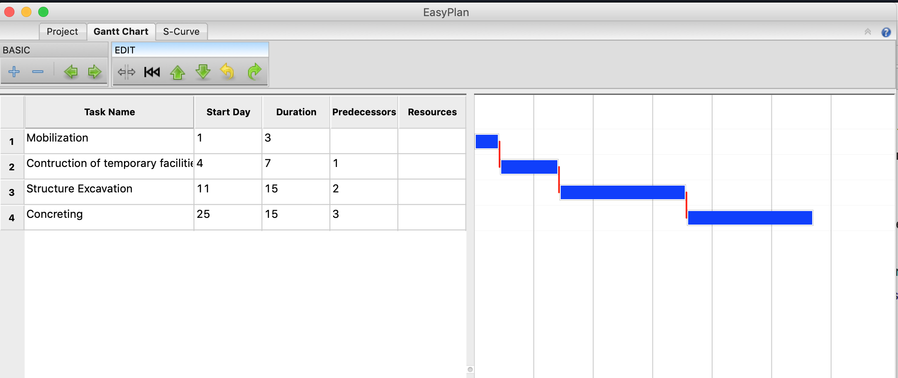
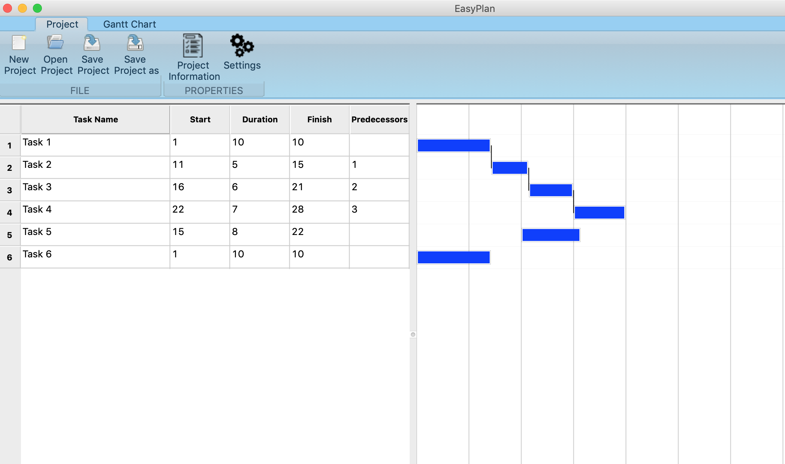

EasyPlan
---
Yet another project scheduling and management software.

### Roadmap
- [ ] Graphical User Interface
  - [ ] Ribbon
    - [ ] Project page
      - [x] New Project
      - [x] Open Project
      - [x] Save Project
      - [ ] Save Project As
        - Save project as new file
      - [ ] Export Project
        - Export project to different formats
    - [ ] Gantt Page
      - [ ] Basic operations panel
      - [ ] Edit panel
        - [x] Split task
        - [x] Merge task segments
        - [x] Move task start
        - [x] Move task up
        - [x] Move task down
        - [x] Undo
        - [x] Redo
    - [ ] Report Page
      - [ ] Printing
  - [ ] WBS
    - [x] Listing of Tasks
    - [x] Start Day column
    - [x] Duration column
    - [x] Predecessor column
    - [ ] Resources column
    - [ ] Group tasks
  - [ ] Gantt
    - [ ] Task Bars
      - [x] Display bars
      - [x] Show splitted task
      - [ ] Draw imaginary line between splitted tasks
      - [x] Drag to move start day
      - [ ] Drag to split segment
      - [x] Drag to move segment
      - [ ] Pop-up properties/information
    - [x] Predecessor Lines
- [ ] Core API
  - [ ] Project Class
  - [x] Task Class
    - [x] Moving of segment
  - [x] Task Segment Class
  - [ ] Resources
  
 ### Screenshot (06/28/2019)

 ### Screenshot (07/06/2019)
